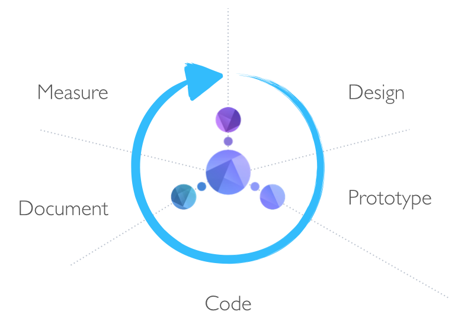

# API Blueprint
### API Design for Humans

[](https://gitter.im/apiaryio/api-blueprint?utm_source=badge&utm_medium=badge&utm_campaign=pr-badge&utm_content=badge)

API Blueprint is a documentation-oriented API description language. A couple of semantic assumptions over the plain [Markdown](http://daringfireball.net/projects/markdown/).

API Blueprint is perfect for designing your Web API and its comprehensive documentation but also for quick prototyping and collaboration. It is easy to learn and even easier to read – after all it is just a form of plain text.

API Blueprint, its parser, and most of its tools are completely open sourced so you don't have to worry about vendor lock-in. This also means you can freely integrate API Blueprint into any type of product, commercial or not.

## TL;DR
+ Web API description language
+ Pure Markdown
+ Designed for humans
+ Understandable by machines
+ Open & free

## Getting started with API Blueprint
All it takes to describe that `message` endpoint of your API is to write:

```md
# GET /message
+ Response 200 (text/plain)

        Hello World!
```

in your favourite Markdown editor. With this API description in your API GitHub repository you can discuss it with others and iterate on your API Design.

To learn more about the API Blueprint syntax jump directly to the [API Blueprint Tutorial](Tutorial.md) or take a look at some [examples](https://github.com/apiaryio/api-blueprint/tree/master/examples).

## Complete Lifecycle
Describing your API is only the start. The API Blueprint can be used by variety of tools from an interactive documentation, SDK generator, debugging proxy and mock server to API testing and analytics tools.



Visit the [tooling section](http://apiblueprint.org/#tooling) of the API Blueprint website to find more about the tools you can use with API Blueprint.

## Machines
Building tools for API Blueprint is possible thanks to its machine-friendly face:

```json
{
    "_version": "2.0",
    "metadata": [],
    "name": "",
    "description": "",

    ...
}
```

\[[full listing](https://github.com/apiaryio/api-blueprint-ast#json-serialization)\]

It is the task for the API Blueprint parser – [Snow Crash][] or one of its language bindings to translate the API Blueprint Markdown representation into a machine friendly format – AST.

If you are interested in building tools for API Blueprint or just to integrate it with your workflow check out the [Developing tools for API Blueprint](https://github.com/apiaryio/api-blueprint/wiki/Developing-tools-for-API-Blueprint).

## Media Type 
The media type for API Blueprint is `text/vnd.apiblueprint+markdown`. 

## Learn more
+ [Tutorial](Tutorial.md)
+ [Examples](examples)
+ [Glossary of Terms](Glossary%20of%20Terms.md)
+ [API Blueprint Map](https://github.com/apiaryio/api-blueprint/wiki/API-Blueprint-Map)
+ [Language Specification](API%20Blueprint%20Specification.md)
+ [Tools working with API Blueprint](http://apiblueprint.org/#tooling)

### Developers
+ [API Blueprint reference parser – Snow Crash](https://github.com/apiaryio/snowcrash)
+ [Snow Crash Bindings to other languages](https://github.com/apiaryio/snowcrash#bindings)
+ [API Blueprint AST Serialization Media Types](https://github.com/apiaryio/api-blueprint-ast)
+ [Developing tools for API Blueprint](https://github.com/apiaryio/api-blueprint/wiki/Developing-tools-for-API-Blueprint)

## Future of API Blueprint
Check out the API Blueprint [Issues Page](https://github.com/apiaryio/api-blueprint/issues) for planned features and issues discussion.

## Contribute
Fork & pull request.

## Have a question?
Ask at [Stack Overflow](http://stackoverflow.com/questions/tagged/apiblueprint), make sure to use the `apiblueprint` tag. Alternatively mention [@apiblueprint](https://twitter.com/apiblueprint) on Twitter.

## License
MIT License. See the [LICENSE](https://github.com/apiaryio/api-blueprint/blob/master/LICENSE) file.

[Snow Crash]: https://github.com/apiaryio/snowcrash
